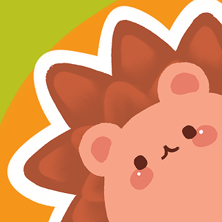

<p align="center">
  
  <h1 align="center">Oasis</h1>
</p>

<p align="center">
  
  
  
  
</p>

<p align="center">
  <a href="https://saurabhcodesawfully.itch.io/oasis-haven"><strong>Try Oasis on itch.io</strong></a>
</p>

A cozy 2D platformer built in Godot. Guide your character through the forest, grab carrots to rack up points, and keep moving your speed and jump height shift randomly every few seconds, so no two runs feel quite the same.

## Features

- **Carrot Collection** - Touch a carrot to add to your score; it vanishes and respawns nearby after a short cooldown
- **Randomized Movement** - Your speed and jump velocity randomize every few seconds, keeping runs unpredictable
- **Live Score Tracking** - On-screen label updates in real time as you collect carrots
- **Dynamic Camera** - Zoomed-in camera follows the player with smoothing for a tight, immersive feel
- **Hand-painted World** - Custom tileset, background art, and character sprites

## Controls

| Key | Action |
|---|---|
| `A` / `Left Arrow` | Move left |
| `D` / `Right Arrow` | Move right |
| `Space` | Jump |

## How It Works

Move through the level and touch carrots scattered around the map to increase your score. Each carrot briefly disappears and reappears at a new spot after being collected, so you'll need to keep exploring. Your movement speed and jump strength change on a timer, so stay on your toes what worked a few seconds ago might not work now.

## Project Structure

```
oasis/
├── assets/
│ ├── sprites/
│ │ ├── bob.png
│ │ ├── carrot.png
│ │ ├── platform.png
│ │ └── background.png
│ └── sound/
│ ├── bgm.mp3
│ └── bite.mp3
├── player.gd
├── food_zone.gd
├── camp_zone.gd
├── main.tscn
├── project.godot
└── README.md
```


## Built With

Built in Godot 4.7 as part of Hack Club's Jumpstart program.

## Author

Auxo

- GitHub: [@Rexaintreal](https://github.com/Rexaintreal)

## License

MIT License - [LICENSE](LICENSE)
